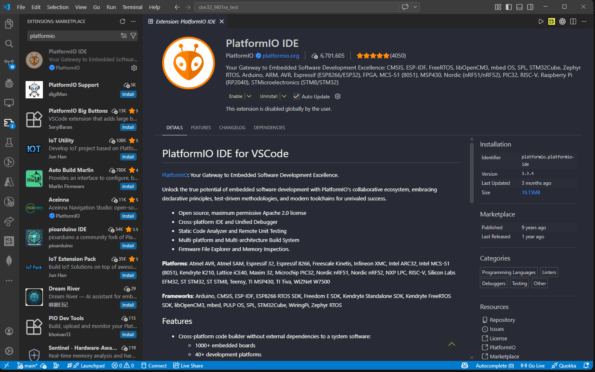
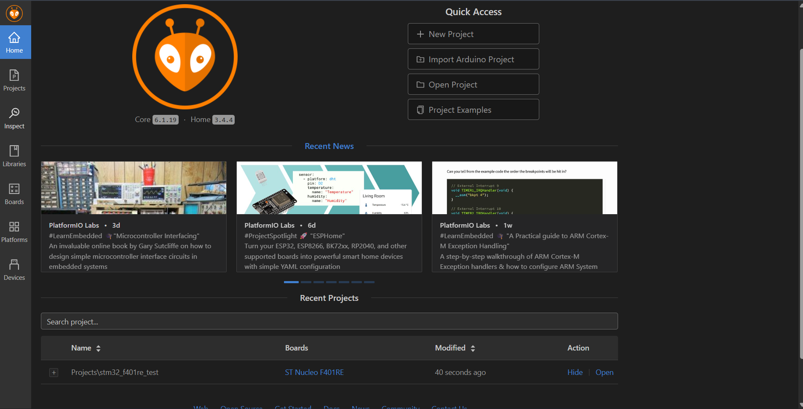
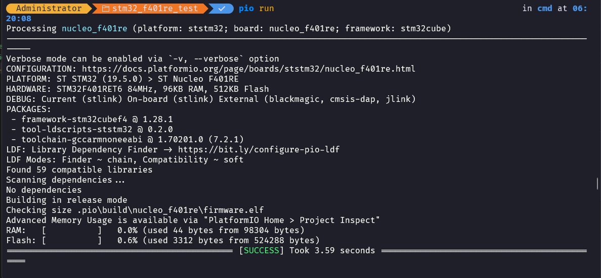
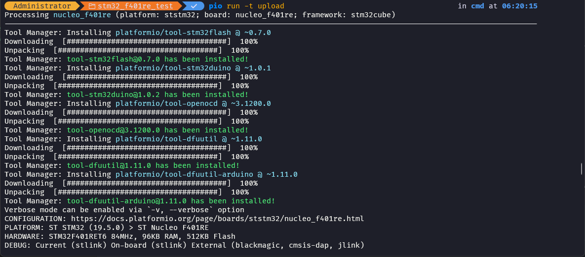
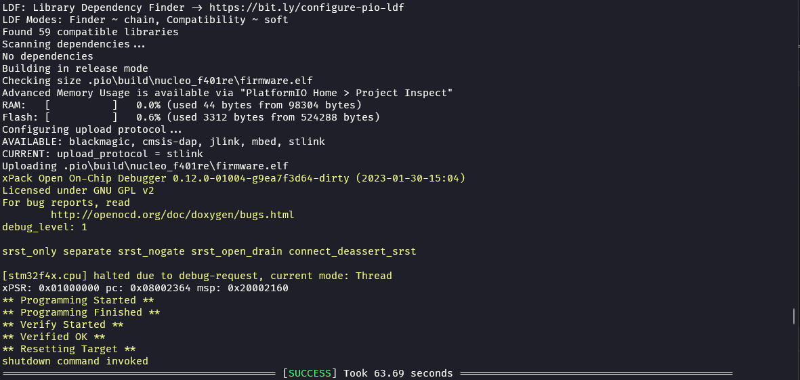
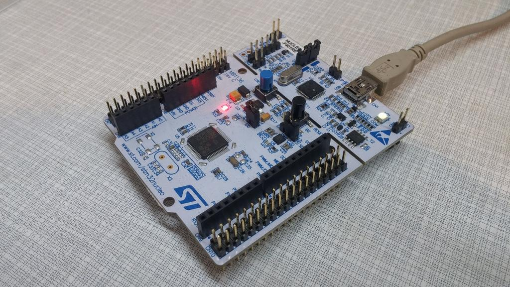

# STM32 Nucleo-F401RE Setup using PlatformIO

## Overview

This project documents the workflow for setting up and programming the STM32 Nucleo-F401RE using PlatformIO in Visual Studio Code.

The goal is to establish a reproducible embedded development environment and demonstrate a basic firmware application.

---

## Tools & Technologies

* STM32 Nucleo-F401RE
* PlatformIO (VS Code Extension)
* STM32Cube Framework (HAL)
* ST-LINK Debugger

---

## System Setup

### 1. Install VS Code and PlatformIO

* Install Visual Studio Code
* Install PlatformIO IDE extension



### 2. Create Project

* Board: nucleo_f401re
* Framework: stm32cube



### 3. Connect Board

* Connect via ST-LINK USB port
* Ensure device is detected

---

## Build & Upload

```bash
pio run
pio run --target upload
```







---

## Example: LED Blink

The onboard LED (PA5) is toggled every 500ms.

```
#include "stm32f4xx_hal.h"

void SystemClock_Config(void)
{
    RCC_OscInitTypeDef RCC_OscInitStruct = {0};
    RCC_ClkInitTypeDef RCC_ClkInitStruct = {0};

    // Configure main internal regulator output voltage
    __HAL_RCC_PWR_CLK_ENABLE();

    // Initializes the CPU, AHB and APB buses clocks
    RCC_OscInitStruct.OscillatorType = RCC_OSCILLATORTYPE_HSI;
    RCC_OscInitStruct.HSIState = RCC_HSI_ON;
    RCC_OscInitStruct.HSICalibrationValue = RCC_HSICALIBRATION_DEFAULT;
    RCC_OscInitStruct.PLL.PLLState = RCC_PLL_NONE;

    HAL_RCC_OscConfig(&RCC_OscInitStruct);

    RCC_ClkInitStruct.ClockType = RCC_CLOCKTYPE_HCLK
                               | RCC_CLOCKTYPE_SYSCLK
                               | RCC_CLOCKTYPE_PCLK1
                               | RCC_CLOCKTYPE_PCLK2;

    RCC_ClkInitStruct.SYSCLKSource = RCC_SYSCLKSOURCE_HSI;
    RCC_ClkInitStruct.AHBCLKDivider = RCC_SYSCLK_DIV1;
    RCC_ClkInitStruct.APB1CLKDivider = RCC_HCLK_DIV1;
    RCC_ClkInitStruct.APB2CLKDivider = RCC_HCLK_DIV1;

    HAL_RCC_ClockConfig(&RCC_ClkInitStruct, FLASH_LATENCY_0);
}

int main(void)
{
    HAL_Init();
    SystemClock_Config();

    __HAL_RCC_GPIOA_CLK_ENABLE();

    GPIO_InitTypeDef GPIO_InitStruct = {0};
    GPIO_InitStruct.Pin = GPIO_PIN_5;
    GPIO_InitStruct.Mode = GPIO_MODE_OUTPUT_PP;
    GPIO_InitStruct.Pull = GPIO_NOPULL;
    GPIO_InitStruct.Speed = GPIO_SPEED_FREQ_LOW;

    HAL_GPIO_Init(GPIOA, &GPIO_InitStruct);

    while (1)
    {
        HAL_GPIO_TogglePin(GPIOA, GPIO_PIN_5);
        HAL_Delay(500);
    }
}
```

## Results

* Successful compilation
* Firmware uploaded via ST-LINK
* LED blinking observed



---

## Troubleshooting

See docs/troubleshooting.md

---

## References

* [STM32 Documentation(https://www.st.com/content/st_com/en.html)
* [PlatformIO Docs](https://docs.platformio.org/en/latest/)
